# BITSIGHT Documentation

## Overview

BITSIGHT is a browser-based visualization tool designed to explore digital images at the bit level with precision. While images appear as cohesive visual compositions to the human eye, they are fundamentally collections of binary data organized into color channels and bit planes. BITSIGHT peels back these layers, revealing patterns, artifacts, and potentially hidden information.

## How It Works

Digital images are made up of pixels, each storing color channel data. Each color channel (Red, Green, Blue, and sometimes Alpha for transparency) stores pixel values as bytes, ranging from 0 to 255 in decimal (00000000 to 11111111 in binary).

These eight bits are not equally significant:
- **Bit 7 (MSB - Most Significant Bit)**: Contributes 128 to the final value
- **Bit 6**: Contributes 64
- **Bit 5**: Contributes 32
- **Bit 4**: Contributes 16
- **Bit 3**: Contributes 8
- **Bit 2**: Contributes 4
- **Bit 1**: Contributes 2
- **Bit 0 (LSB - Least Significant Bit)**: Contributes 1

By isolating and visualizing individual bit planes, or combinations of them, BITSIGHT reveals patterns that would otherwise remain imperceptible to the human eye.

## Rendering Modes

### Heatmap Mode

In heatmap mode, BITSIGHT calculates a weighted sum of all selected bit planes and normalizes the result to create a grayscale visualization. Higher values appear brighter, lower values appear darker. This mode is ideal for:
- Seeing the relative contribution of selected bits
- Identifying patterns in combined bit planes
- Creating artistic monochrome effects

### Binary Mode

Binary mode applies logical operations across selected bit planes, resulting in pure black and white output. Available operators:

- **OR**: Pixel is white if ANY selected bit is 1
- **AND**: Pixel is white only if ALL selected bits are 1
- **XNOR**: Pixel is white if all selected bits are the same (all 0s or all 1s)
- **MAJORITY**: Pixel is white if more than half of selected bits are 1
- **MINORITY**: Pixel is white if more than half of selected bits are 0

You can select any of these modes, or the heatmap mode in the UI on the left, then select the bits from each channel you want to use the filter on.

## Primary Purpose: Steganography Detection

Steganography is the practice of concealing information within other information. Unlike cryptography, which makes information unreadable, steganography aims to make the very existence of a message undetectable. Both techniques are often combined for maximum security.

The most common steganographic technique involves replacing the least significant bits of an image with the bits of a secret message. Since these bits contribute minimally to the visible appearance (only 1/255th of the total value), the carrier image looks nearly identical to the original. A message can be distributed across thousands of pixels, with each pixel's contribution being so small that visual detection becomes nearly impossible without specialized tools.

I initially created BITSIGHT specifically to detect steganography in images, which often hide data in the least significant bits. By isolating these lower bit planes, hidden patterns become visible that would be completely imperceptible in the normal image.

Here is an example of a (poorly) hidden message inside an image:

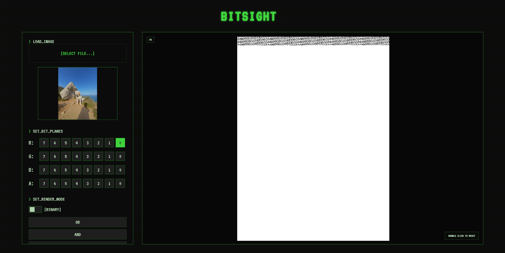

You can see that the tool completely wiped the entire LSB layer and wrote a binary message directly into the red channel.

## Other Use Cases

### Artifact Detection

While testing the tool, I discovered additional practical applications beyond steganography detection:
- **Image Editing Detection**: Edited regions often show different noise patterns than the original image
- **AI Generation Detection**: AI-generated images can exhibit unusual regularities in their bit patterns
- **Image Nature Analysis**: Distinguishing between photographs, 3D renders, and other image types

Real photographs exhibit naturally even noise distribution across bit planes. Excessive organization or patterns in this noise can betray image manipulation, AI generation, or compression. Here is an example of a real picture, and then an AI-generated picture's LSB:

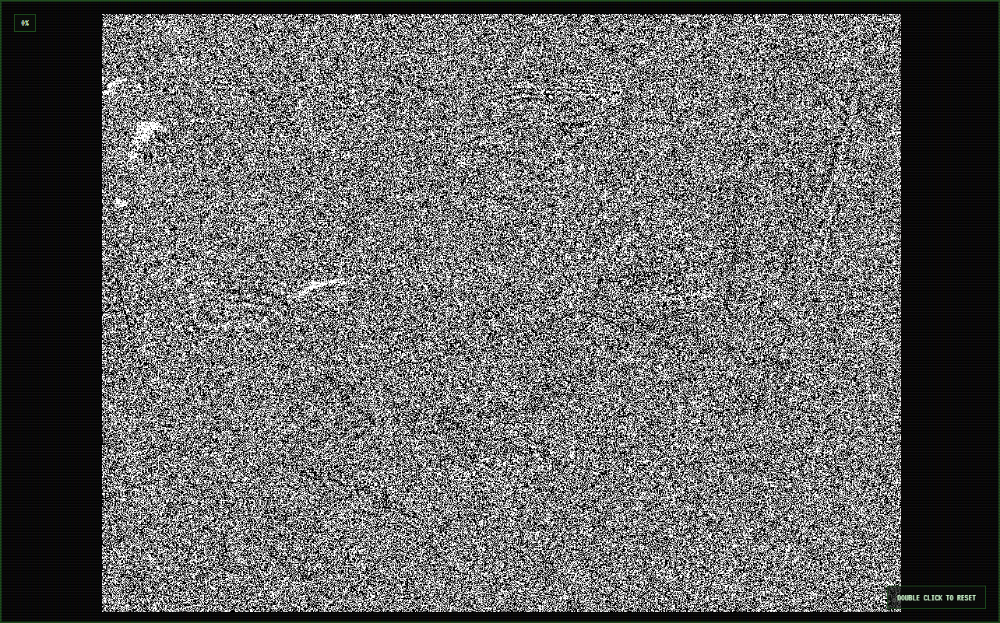

Here you can see the noise is pretty evenly distributed on the LSBs. Because it is a real picture.
However here :

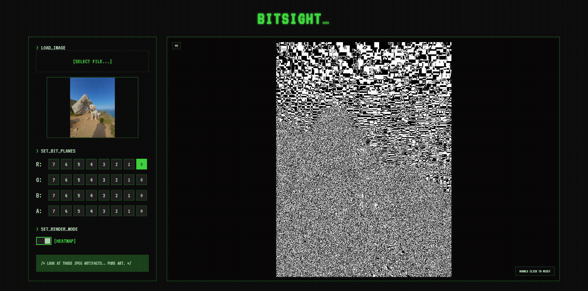

You can see that there are inconsistent JPEG compression artifacts at the LSB level.

Here is an example of an edited image:

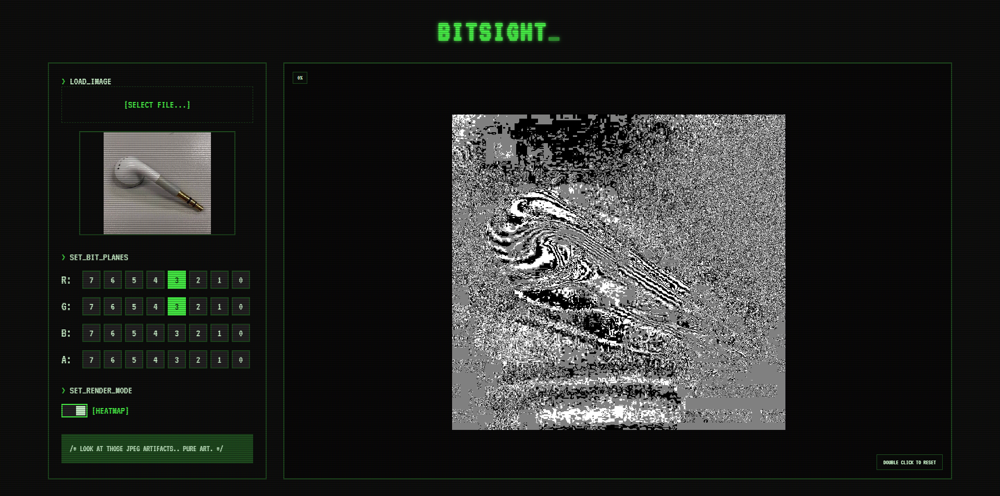

You can see unnatural, overly smooth noise and different types of noise overlapping each other.

And here is an example of a processed image (3D):

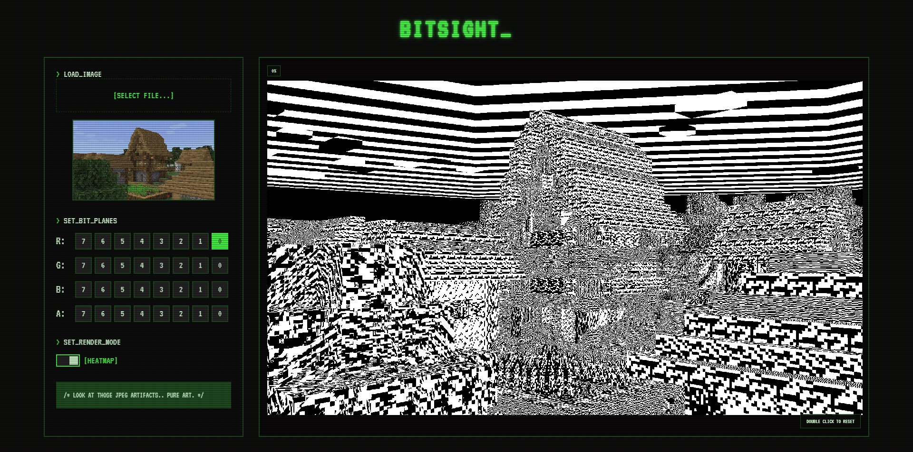

You can see that there is no compression at all since it is a raw image from the CPU. You can also see overly smooth patterns with perfectly distributed noise.

### XNOR Operator Power

The XNOR operator is particularly powerful when it comes to edge detection and highlighting compression artifacts.

Edge highlighting:

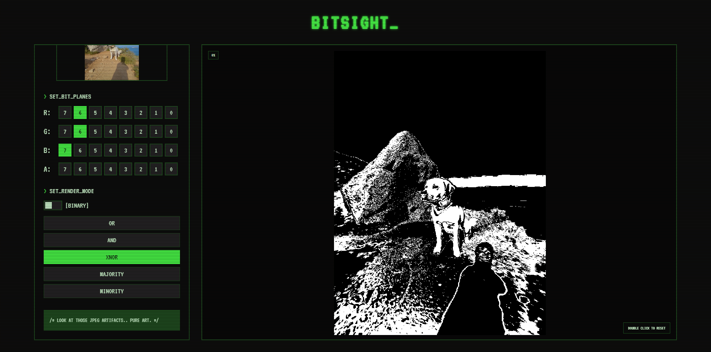

JPEG compression highlighting:

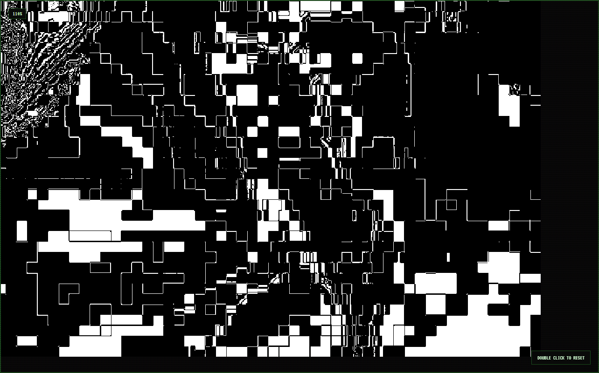

### Creative Filters

Beyond technical analysis, BITSIGHT serves as an unexpected filter application:

- **Monochrome Filter**: Combine every bit of a single channel, or every bit of every channel:

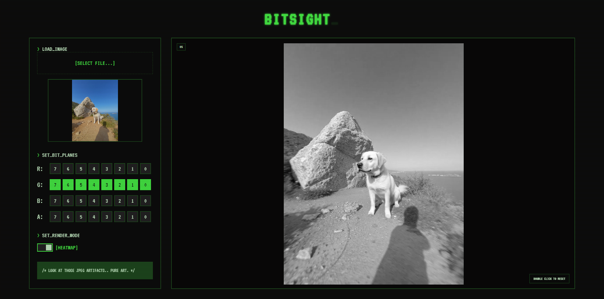

- **Poster Effect**: Select only the most significant bits:

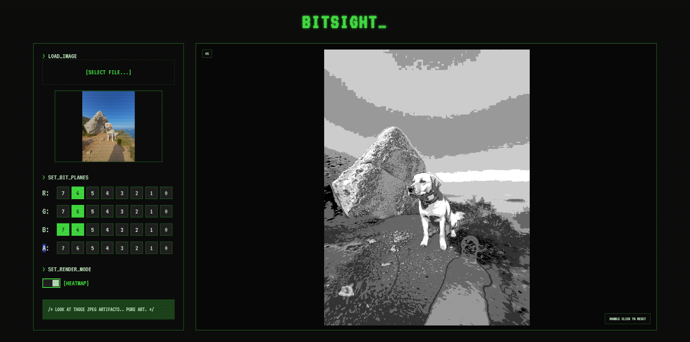

- **Chrome Effect**: Select every other bit for a metallic appearance:

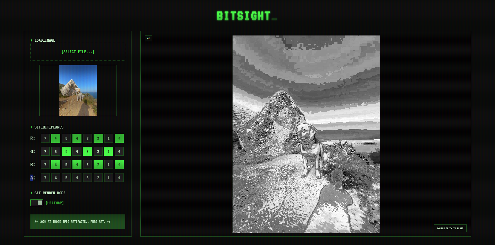

- **Majority/Minority Operators**: Can create cell-shading or dithering effects depending on the image and selected layers:

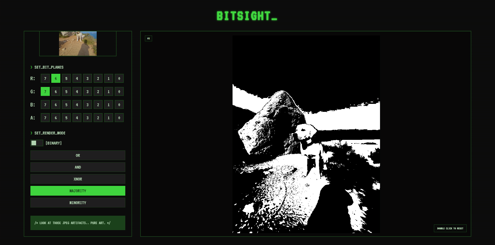

## Limitations

### Performance

BITSIGHT is a small project coded with a lot of AI assistance, meaning optimization was not the primary focus. It can be slow, especially with:
- Large images
- Multiple layers selected simultaneously

Since it's a local tool made primarily for personal use, I've decided these performance limitations are acceptable. It works; I won't fix it.

### Detection Capabilities

- **Sophisticated Steganography**: Advanced steganographic methods that use encryption, spread-spectrum techniques, or adaptive LSB replacement hide information so effectively that BITSIGHT becomes useless for detection
- **Better Alternatives**: More sophisticated tools likely exist for professional steganography analysis.
- **Detection vs. Decryption**: BITSIGHT is designed to help DETECT artifacts and anomalies in images, not to identify or decipher their exact nature or content
